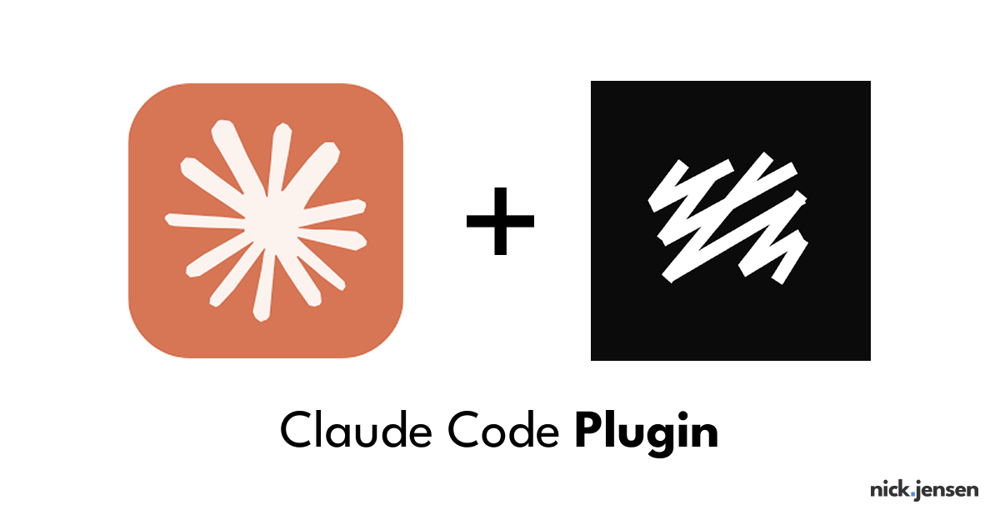

# Sanity CMS Plugin Marketplace for Claude Code

<p align="center">
  
</p>

> Complete Sanity development toolkit - schemas, queries, migrations, plugins, structure, widgets, and AI-powered actions.

[](git@github.com:ncklrs/sanity-agents.git)
[]()
[]()

A comprehensive marketplace of 7 specialized plugins for Sanity CMS developers using Claude Code. From schema design to AI-powered content transformations, these plugins cover every aspect of Sanity development.

**Quick Install**: `/plugin marketplace add git@github.com:ncklrs/sanity-agents.git`

## 🚀 Quick Start

### 1. Add the Marketplace

```bash
# Start Claude Code
claude

# Add this marketplace from GitHub
/plugin marketplace add https://github.com/ncklrs/sanity-agents.git

# Browse available plugins
/plugin
```

### 2. Install Plugins

Install all plugins for complete Sanity CMS support:

```bash
# Core Development Tools (Install these first)
/plugin install sanity-schema-helper@sanity-marketplace
/plugin install sanity-groq-assistant@sanity-marketplace
/plugin install sanity-migration-helper@sanity-marketplace

# Studio Customization Tools
/plugin install sanity-plugin-creator@sanity-marketplace
/plugin install sanity-structure-builder@sanity-marketplace
/plugin install sanity-widget-creator@sanity-marketplace

# AI-Powered Content Tools
/plugin install sanity-content-actions@sanity-marketplace
```

Or select "Install now" when browsing plugins via `/plugin`.

### 3. Restart Claude Code

After installation, restart Claude Code to activate the plugins.

### 4. Start Using

```bash
# Schema design
/create-schema

# Query building
/build-query

# Migrations
/plan-migration

# Plugin creation
/create-plugin

# Structure organization
/build-structure

# Dashboard widgets
/create-widget

# AI content actions
/create-content-action
```

---

## 📦 Available Plugins

### Core Development Tools

<details>
<summary><strong>1. Sanity Schema Helper</strong> - Schema architecture and validation</summary>

Expert schema architect for designing type-safe, scalable content models.

**Capabilities:**
- ✅ Create document and object schemas with best practices
- ✅ Design portable text configurations
- ✅ Configure field validation and preview settings
- ✅ Generate TypeScript types with defineType/defineField
- ✅ Validate existing schemas against best practices
- ✅ Refactor complex schema architectures

**Commands:**
- `/create-schema` - Interactive schema creation with expert guidance

**Agents:**
- `schema-architect` - Deep-dive agent for complex schema projects

**Skills:**
- `sanity-validator` - Auto-validates schemas when reading schema files

**Example Usage:**
```bash
/create-schema
# "I need a blog post schema with author references and categories"

# Or use the agent for complex projects:
# "Use the schema-architect agent to refactor my e-commerce product schemas"
```

**Key Features:**
- Enforces Sanity best practices (alt text, validation, previews)
- Generates production-ready TypeScript code
- Organizes fields with groups for better Studio UX
- Suggests optimal field types and validation rules
- Designs for both editor experience and query performance

</details>

<details>
<summary><strong>2. Sanity GROQ Assistant</strong> - Query building and optimization</summary>

Expert GROQ query builder and optimizer for performant data fetching.

**Capabilities:**
- ✅ Build complex GROQ queries with proper syntax
- ✅ Optimize queries for performance (projection, filtering, limiting)
- ✅ Handle references, arrays, and nested data
- ✅ Generate TypeScript-typed queries
- ✅ Debug and fix GROQ syntax errors
- ✅ Analyze and refactor slow queries

**Commands:**
- `/build-query` - Interactive GROQ query builder

**Agents:**
- `groq-optimizer` - Analyzes and optimizes existing queries

**Skills:**
- `groq-optimizer` - Auto-analyzes queries when reading GROQ code

**Example Usage:**
```bash
/build-query
# "Get all published blog posts with author info and categories, paginated"

# Or optimize existing queries:
# "Use the groq-optimizer agent to improve performance of my product queries"
```

**Performance Impact:**
- 87% faster queries with proper optimization
- 93% smaller payloads with projection
- Eliminates N+1 query problems

</details>

<details>
<summary><strong>3. Sanity Migration Helper</strong> - Safe content migrations</summary>

Safe content migration and schema evolution specialist.

**Capabilities:**
- ✅ Plan safe schema migrations with rollback strategies
- ✅ Generate migration scripts with validation and error handling
- ✅ Handle breaking schema changes safely
- ✅ Batch processing for large datasets
- ✅ Validate data before and after migrations
- ✅ Create comprehensive backup procedures

**Commands:**
- `/plan-migration` - Interactive migration planning

**Agents:**
- `migration-architect` - Complex, multi-phase migration planning

**Skills:**
- `migration-validator` - Auto-validates migration scripts for safety

**Example Usage:**
```bash
/plan-migration
# "Add a required 'category' field to 5,000 blog posts"

# For complex migrations:
# "Use migration-architect to plan zero-downtime migration for our production site"
```

**Safety Features:**
- Dry-run mode for testing
- Pre and post-migration validation
- Automatic rollback procedures
- Idempotent migrations (safe to re-run)

</details>

### Studio Customization Tools

<details>
<summary><strong>4. Sanity Plugin Creator</strong> - Custom plugins and extensions</summary>

Expert Sanity plugin architect for creating custom Studio plugins and tools.

**Capabilities:**
- ✅ Create custom Sanity plugins from scratch
- ✅ Build custom input components and fields
- ✅ Generate plugin configuration and setup
- ✅ Create reusable tools and utilities
- ✅ Package plugins for npm distribution
- ✅ Integrate third-party services via plugins

**Commands:**
- `/create-plugin` - Interactive plugin creation

**Agents:**
- `plugin-architect` - Complex multi-component plugin development

**Skills:**
- `plugin-validator` - Auto-validates plugin code for best practices

**Example Usage:**
```bash
/create-plugin
# "Create a custom color picker input component"

# For complex plugins:
# "Use plugin-architect to build a complete DAM integration plugin"
```

**Plugin Types:**
- Custom input components
- Document actions
- Studio tools
- Form components
- Asset sources

</details>

<details>
<summary><strong>5. Sanity Structure Builder</strong> - Studio navigation</summary>

Expert Studio structure architect for designing custom navigation and desk organization.

**Capabilities:**
- ✅ Design custom Studio navigation structure
- ✅ Create organized document lists with filters
- ✅ Build nested menu hierarchies
- ✅ Configure custom list views and previews
- ✅ Set up role-based navigation
- ✅ Create singleton document panes

**Commands:**
- `/build-structure` - Interactive structure design

**Agents:**
- `structure-architect` - Complex multi-level structure design

**Skills:**
- `structure-validator` - Auto-validates structure configurations

**Example Usage:**
```bash
/build-structure
# "Create a structure for a blog with posts, authors, and categories"

# For enterprise structures:
# "Use structure-architect to design navigation for 100+ document types"
```

**Structure Patterns:**
- Flat structures for simple sites
- Nested hierarchies for complex content
- Role-based navigation
- Filtered list views

</details>

<details>
<summary><strong>6. Sanity Widget Creator</strong> - Dashboard widgets</summary>

Expert Studio widget architect for creating dashboard widgets and custom UI components.

**Capabilities:**
- ✅ Create custom Studio dashboard widgets
- ✅ Build analytics and reporting widgets
- ✅ Design content overview panels
- ✅ Create quick action widgets
- ✅ Build data visualization components
- ✅ Integrate external data sources

**Commands:**
- `/create-widget` - Interactive widget creation

**Agents:**
- `widget-architect` - Complex multi-widget dashboard design

**Skills:**
- `widget-validator` - Auto-validates widget code for performance and UX

**Example Usage:**
```bash
/create-widget
# "Create a widget showing total documents by type"

# For complex dashboards:
# "Use widget-architect to build an analytics dashboard with 10+ widgets"
```

**Widget Types:**
- Content statistics
- Recent activity
- Quick actions
- External API integrations
- Analytics and charts

</details>

### AI-Powered Content Tools

<details>
<summary><strong>7. Sanity Content Actions</strong> - AI-powered transformations</summary>

Expert content transformation specialist with AI-powered translate, generate, and transform actions.

**Capabilities:**
- ✅ Create AI-powered document actions
- ✅ Build translation workflows with OpenAI/Claude
- ✅ Generate content summaries and descriptions
- ✅ Transform content formats and structures
- ✅ Enhance content with AI improvements
- ✅ Batch content operations with AI

**Commands:**
- `/create-content-action` - Interactive AI action creation

**Agents:**
- `action-architect` - Complex multi-step AI workflows

**Skills:**
- `action-validator` - Auto-validates action code for security and reliability

**Example Usage:**
```bash
/create-content-action
# "Create a document action to translate content to Spanish"

# For complex workflows:
# "Use action-architect to build a content quality pipeline (check → enhance → publish)"
```

**AI Actions:**
- Multi-language translation
- Auto-generate meta descriptions
- SEO content optimization
- Image alt text generation
- Content summarization
- Writing enhancement

**Supported AI Providers:**
- OpenAI (GPT-4, GPT-3.5)
- Anthropic Claude
- OpenAI Vision
- DeepL Translation
- Custom models

</details>

---

## 🎯 Complete Development Workflow

### 1. Schema Design Phase
```bash
# Design your content model
/create-schema
> "Create a product schema with variants and inventory"

# Validate existing schemas
[Open schema file - sanity-validator skill auto-activates]
```

### 2. Query Development Phase
```bash
# Build efficient queries
/build-query
> "Get products with filters for price range and category"

# Optimize slow queries
[Open query file - groq-optimizer skill auto-activates]
```

### 3. Studio Customization Phase
```bash
# Organize Studio navigation
/build-structure
> "Create a structure with nested categories"

# Add custom functionality
/create-plugin
> "Build a custom asset picker for our DAM"

# Create dashboard widgets
/create-widget
> "Build an analytics widget for content metrics"
```

### 4. Content Enhancement Phase
```bash
# Add AI-powered actions
/create-content-action
> "Create an action to auto-generate SEO descriptions"
```

### 5. Migration Phase
```bash
# Plan schema evolution
/plan-migration
> "Add localization to all existing content"
```

---

## 🏗️ Plugin Architecture

Each plugin follows a three-tier architecture:

```
plugin-name/
├── .claude-plugin/
│   └── plugin.json          # Plugin metadata
├── commands/
│   └── command-name.md      # Interactive user command
├── agents/
│   └── agent-name.md        # Autonomous specialist agent
└── skills/
    └── skill-name/
        └── SKILL.md         # Auto-triggered validation
```

**Commands** (User-Invoked)
- Interactive Q&A workflows
- Immediate value for common tasks
- Step-by-step guidance

**Agents** (Autonomous)
- Complex multi-step projects
- Deep codebase analysis
- Autonomous problem-solving

**Skills** (Auto-Triggered)
- Activate when reading files
- Proactive code quality checks
- Instant validation feedback

---

## 📊 Plugin Comparison

| Plugin | Primary Use | Command | Agent | Skill |
|--------|-------------|---------|-------|-------|
| Schema Helper | Design content models | `/create-schema` | schema-architect | sanity-validator |
| GROQ Assistant | Build queries | `/build-query` | groq-optimizer | groq-optimizer |
| Migration Helper | Evolve schemas | `/plan-migration` | migration-architect | migration-validator |
| Plugin Creator | Build extensions | `/create-plugin` | plugin-architect | plugin-validator |
| Structure Builder | Organize Studio | `/build-structure` | structure-architect | structure-validator |
| Widget Creator | Dashboard UI | `/create-widget` | widget-architect | widget-validator |
| Content Actions | AI automation | `/create-content-action` | action-architect | action-validator |

---

## 🔧 Configuration

### Team Setup

Add to your repository's `.claude/settings.json` for automatic team installation:

```json
{
  "marketplaces": [
    {
      "name": "sanity-marketplace",
      "source": "git@github.com:ncklrs/sanity-agents.git"
    }
  ],
  "plugins": [
    "sanity-schema-helper@sanity-marketplace",
    "sanity-groq-assistant@sanity-marketplace",
    "sanity-migration-helper@sanity-marketplace",
    "sanity-plugin-creator@sanity-marketplace",
    "sanity-structure-builder@sanity-marketplace",
    "sanity-widget-creator@sanity-marketplace",
    "sanity-content-actions@sanity-marketplace"
  ]
}
```

When team members trust the repository, all plugins install automatically.

**Alternative**: You can also use HTTPS:
```json
{
  "marketplaces": [
    {
      "name": "sanity-marketplace",
      "source": "https://github.com/ncklrs/sanity-agents.git"
    }
  ]
}
```

---

## 📚 Use Case Examples

### Blog Platform Development
```bash
# 1. Design schema
/create-schema → Blog post, author, category schemas

# 2. Build queries
/build-query → Post lists, single post, related posts

# 3. Organize Studio
/build-structure → Group blog content logically

# 4. Add widgets
/create-widget → Recent posts, draft count

# 5. AI enhancement
/create-content-action → Auto-generate meta descriptions
```

### E-commerce Site
```bash
# 1. Product schemas
/create-schema → Products, variants, collections

# 2. Product queries
/build-query → Product filters, search, recommendations

# 3. Custom plugins
/create-plugin → Custom variant selector

# 4. Studio structure
/build-structure → Products organized by category

# 5. Translation
/create-content-action → Multi-language product content
```

### Enterprise CMS
```bash
# 1. Complex schemas
schema-architect agent → 50+ document types

# 2. Query optimization
groq-optimizer agent → Analyze all queries

# 3. Role-based Studio
structure-architect agent → Multi-role navigation

# 4. Analytics dashboard
widget-architect agent → 10+ monitoring widgets

# 5. Content workflows
action-architect agent → Approval and publishing pipeline
```

---

## 🎓 Learning Path

### Beginners
1. Start with **Schema Helper** - Learn content modeling
2. Use **GROQ Assistant** - Understand queries
3. Try **Structure Builder** - Organize Studio
4. Explore **Widget Creator** - Add dashboard widgets

### Intermediate
1. **Migration Helper** - Schema evolution
2. **Plugin Creator** - Custom functionality
3. **Content Actions** - AI integration

### Advanced
1. Use agents for complex projects
2. Combine multiple plugins in workflows
3. Build custom marketplace plugins
4. Contribute improvements

---

## 🆘 Troubleshooting

### Plugins not showing in /help
- Restart Claude Code after installation
- Verify: `/plugin` → "Manage Plugins"

### Commands not working
- Enable plugin: `/plugin enable plugin-name@sanity-marketplace`
- Check Claude Code version compatibility

### Skills not activating
- Skills activate automatically when reading relevant files
- No action needed - just open schema/query/widget files

### Getting Help
```bash
# Ask the plugins directly
/create-schema
> "How do I create a portable text configuration?"

/build-query
> "What's the best way to handle pagination?"

/create-content-action
> "How do I integrate OpenAI for translations?"
```

---

## 🎯 Roadmap

- [ ] Visual schema designer
- [ ] GROQ query builder UI
- [ ] Migration testing toolkit
- [ ] Plugin marketplace browser
- [ ] AI content approval workflows
- [ ] Real-time collaboration widgets
- [ ] Advanced analytics integrations

---

## 🤝 Contributing

### Adding New Plugins

1. Create plugin directory in `plugins/`
2. Add plugin manifest (`.claude-plugin/plugin.json`)
3. Create commands, agents, and/or skills
4. Update `marketplace.json`
5. Test locally
6. Update documentation

### Plugin Ideas
- Sanity localization assistant
- Content scheduling manager
- Media library organizer
- Workflow automation builder
- Testing utilities
- Documentation generator

---

## 📝 License

MIT License - free to use, modify, and distribute.

---

## 🔗 Resources

- [Sanity Documentation](https://www.sanity.io/docs)
- [Claude Code Plugins Guide](https://docs.claude.com/claude-code/plugins)
- [GROQ Reference](https://www.sanity.io/docs/groq)
- [Plugin Development](https://www.sanity.io/docs/plugins)

---

**Built with ❤️ for the Sanity CMS community**

Made possible by [Claude Code](https://claude.com/claude-code) extensibility.
